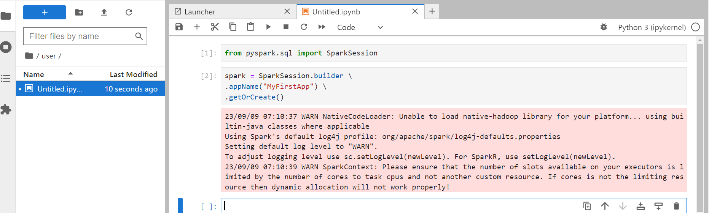
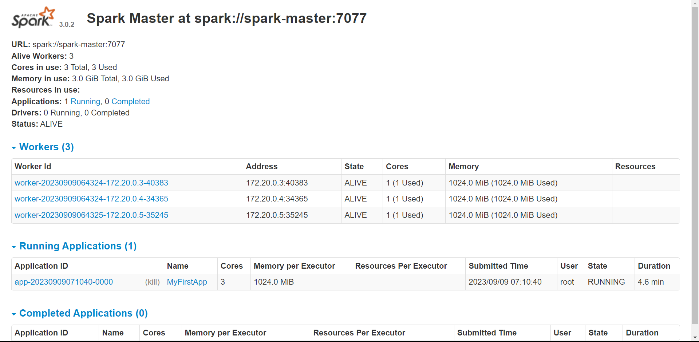
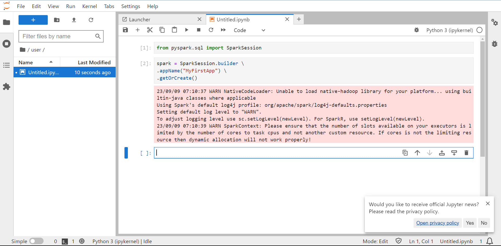

# Spark_Developer_interface
## Introduction:
This Project is for folks who want to practice Spark on distributed system also as we know running spark on local and on distributed system is a completely 
different also renting cluster on cloud can be costly so using power of docker I have build this Project so we can get a spark cluster ready to use along 
with Jupyter Lab attached to it also for security if code that you write that can will be automatically sync with a local folder.

## Prerequisites:
* Install Docker using fallowing https://docs.docker.com/engine/install/ Or Upgrade if having Older Version
* Create folder >> user this will be used for copying all yor required files to Docker Container eg .ipynb, .jar .py to user folder inside docker container
`mkdir user `
* FYI This folder inside container will do one time sync from local user folder to container user folder and after you start developing container user folder will do one way realtime sync to local user folder.

## Setting up
* In your folder where you want to create this project wher you already have created `user` folder copy the `docker-compose.yaml` from this repo to your project folder 
* Run `docker-compose up -d --scale spark-worker=3` to deploy ths cluster where 3 is the count of spark workers nodes you can change it as per your requirement to any practically possible number.
* To Stop the Containers Run `docker-compose down`
* To Run some command on jupyter demon you can `docker exec submit-demon <your command>`
* To copy some files into container you can run `docker container cp /pth/to/your/file.txt submit-demon:file.txt`
* Your Spark UI will be hosted on `localhost:8080`
* Your Jupyter lab will be at `localhost:8888`
## FYI's
* Try to use `user` folder that you will be able to see in jupyter lab folder it will automatically sync your development into your local machine so that you never lose your code.
* while running your code please try not to declare master cause by default it is pointed to cluster so no need to declare master 
* We are using amazonlinux:2023 as base image which is on x86_64 architecture also it is based on RHEL (Red Hat Enterprise Linux) so default package managers will be same underlying  
* Spark UI: 
* Jupyter UI: 